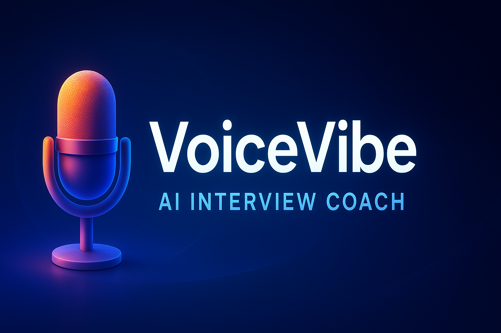

# 🎤 VoiceVibe – AI Interview Coach

<div align="center">
  
</div>

<div align="center">
  
**Your personal AI-powered interview coach that helps you ace job interviews through realistic simulations and instant feedback**

[](https://voicevibe-nine.vercel.app)
[](LICENSE)
[](https://nextjs.org/)
[](https://openai.com/)

</div>

---

## 📌 What is VoiceVibe?

VoiceVibe is a cutting-edge, production-ready web application that revolutionizes interview preparation through AI-powered simulations. Leveraging OpenAI's GPT-4 for intelligent question generation and Whisper for speech recognition, VoiceVibe provides a realistic interview experience with instant, actionable feedback on both spoken and written responses.

### 🌟 Core Value Proposition
- **Personalized Coaching**: Tailored questions based on your target role, experience level, and interview type
- **Multi-modal Interaction**: Choose between voice or text responses to match your preference
- **Data-Driven Improvement**: Visual analytics to track your progress over time
- **Zero-Cost Infrastructure**: Built entirely on free-tier services with pay-as-you-go AI usage

---

## ✨ Key Features

| Feature | Description | Technology |
|---------|-------------|------------|
| 🧠 **AI-Powered Questions** | Context-aware questions generated by GPT-4 based on role, difficulty, and interview type | OpenAI GPT-4 |
| 🎙️ **Voice Recognition** | Convert spoken answers to text with industry-leading accuracy | Whisper API |
| 📊 **Progress Analytics** | Visual dashboards showing improvement trends and performance distribution | Recharts |
| 🔐 **Secure Authentication** | Multiple sign-in options with enterprise-grade security | Clerk |
| 📄 **Resume Integration** | Upload your resume for personalized question generation | Vercel Blob |
| 🌗 **Theme Switching** | Seamless dark/light mode toggle with system preference detection | Tailwind CSS |
| 📈 **Performance Monitoring** | Built-in analytics to track user engagement and application performance | Vercel Analytics |
| 🚀 **Cost-Effective** | Entire infrastructure runs on free tiers with minimal operational costs | Vercel Platform |

---

## 🛠️ Technology Stack

<div align="center">

| Category | Technologies |
|----------|--------------|
| **Frontend** |    |
| **Styling** |   |
| **Backend** |  |
| **Database** |  |
| **Authentication** |  |
| **Storage** |  |
| **AI Services** |   |
| **Analytics** |   |
| **Deployment** |  |

</div>

---

## 📦 Environment Configuration

Create a `.env.local` file in the root directory with the following variables:

| Variable | Description |
|----------|-------------|
| `OPENAI_API_KEY` | Your OpenAI API key for GPT-4 and Whisper access |
| `NEXT_PUBLIC_OPENAI_API_KEY` | Public OpenAI API key for client-side requests |
| `NEXT_PUBLIC_CLERK_PUBLISHABLE_KEY` | Clerk authentication public key |
| `CLERK_SECRET_KEY` | Clerk authentication secret key |
| `NEXT_PUBLIC_CLERK_SIGN_IN_URL` | URL for sign-in page |
| `NEXT_PUBLIC_CLERK_SIGN_UP_URL` | URL for sign-up page |
| `NEXT_PUBLIC_CLERK_AFTER_SIGN_IN_URL` | Redirect URL after sign-in |
| `NEXT_PUBLIC_CLERK_AFTER_SIGN_UP_URL` | Redirect URL after sign-up |
| `POSTGRES_URL` | Vercel Postgres database connection string |
| `BLOB_READ_WRITE_TOKEN` | Vercel Blob storage access token |

> ⚠️ **Security Note**: Never commit your `.env.local` file to version control. Add it to your `.gitignore` file.

---

## 🚀 Getting Started

### Prerequisites
- Node.js 18.0 or later
- npm or yarn package manager
- OpenAI API key
- Clerk authentication credentials

### Installation

1. **Clone the repository**
   ```bash
   git clone https://github.com/<you>/voicevibe.git
   cd voicevibe
   ```

2. **Install dependencies**
   ```bash
   npm install
   ```

3. **Set up environment variables**
   - Copy `.env.example` to `.env.local`
   - Fill in your credentials from the Environment Configuration section

4. **Run the development server**
   ```bash
   npm run dev
   ```

5. **Build for production**
   ```bash
   npm run build
   npm start
   ```

---

## 📋 Project Development Phases

| Phase | Focus Area | Key Components |
|-------|------------|----------------|
| **Phase 1** | Foundation | Project setup, Next.js 14, TypeScript, Tailwind CSS, Clerk, ShadCN UI |
| **Phase 2** | User Experience | Landing page design, authentication flows, responsive layout |
| **Phase 3** | Core Functionality | Protected dashboard, interview creation form, resume upload system |
| **Phase 4** | AI Integration | Live mock interview interface, text/voice Q&A, GPT-4 feedback system |
| **Phase 5** | Analytics | Performance tracking, data visualization with Recharts, progress metrics |
| **Phase 6** | Production | Deployment to Vercel, SEO optimization, analytics integration, dark mode polish |

---

## 🎯 User Journey

1. **Onboarding**
   - Sign Up/In using Clerk (email, Google, GitHub)
   - Complete account setup and profile configuration

2. **Interview Preparation**
   - Create a new interview session
   - Select target role (e.g., Software Engineer, Product Manager)
   - Choose difficulty level (Entry, Mid, Senior)
   - Pick interview type (Technical, Behavioral, System Design)
   - Optionally upload resume for personalized questions

3. **Mock Interview**
   - Engage in realistic interview simulation
   - Receive AI-generated questions based on selections
   - Respond via voice (Whisper) or text
   - Get instant feedback on content, delivery, and improvement areas

4. **Progress Tracking**
   - Access detailed analytics dashboard
   - View performance trends over time
   - Analyze score distribution across question categories
   - Identify strengths and weaknesses through comparison metrics

5. **Continuous Improvement**
   - Repeat practice sessions to refine skills
   - Track progress over time
   - Build confidence for real interviews
   - Achieve interview mastery

---

## 🔒 License

This project is licensed under the MIT License - see the [LICENSE](LICENSE) file for details.

<div align="center">

**© 2025 VoiceVibe. All rights reserved.**

[](https://voicevibe-nine.vercel.app)
[](https://github.com/<you>/voicevibe)

</div>
